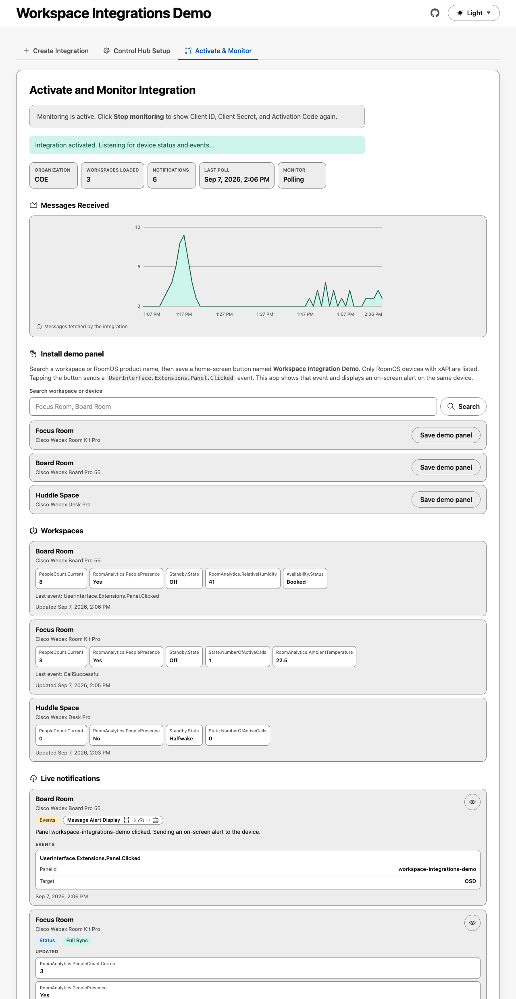
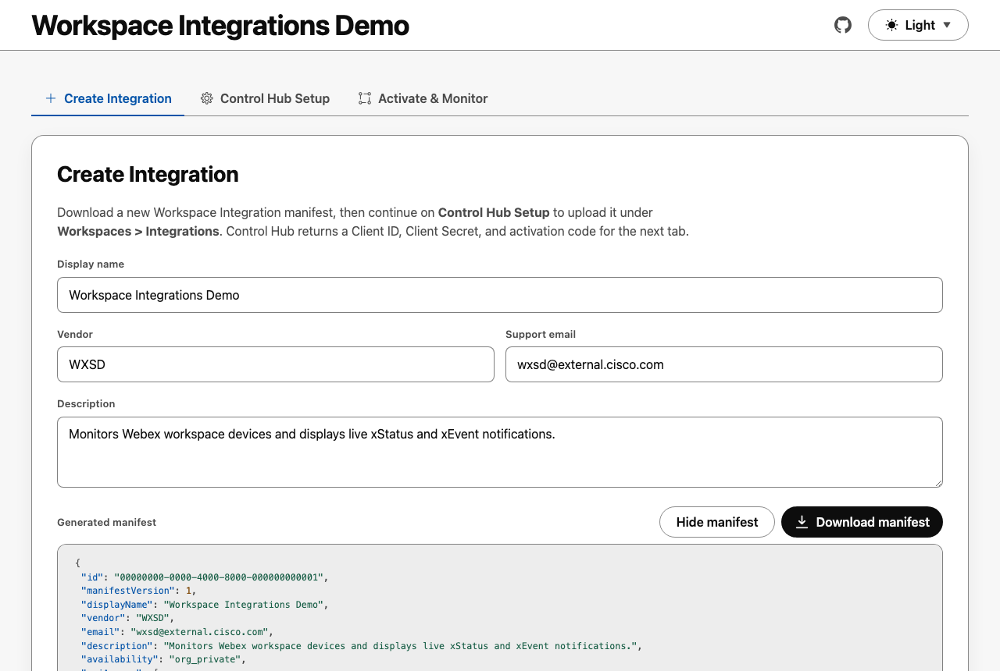
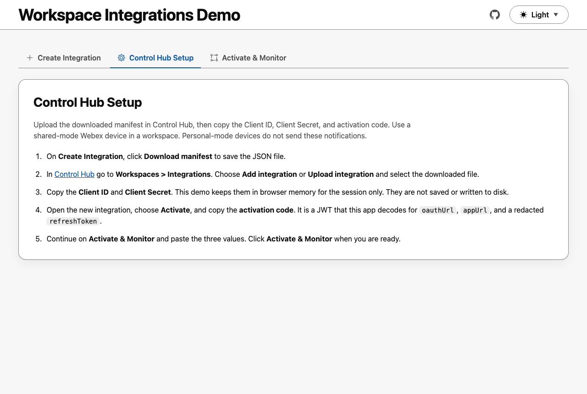
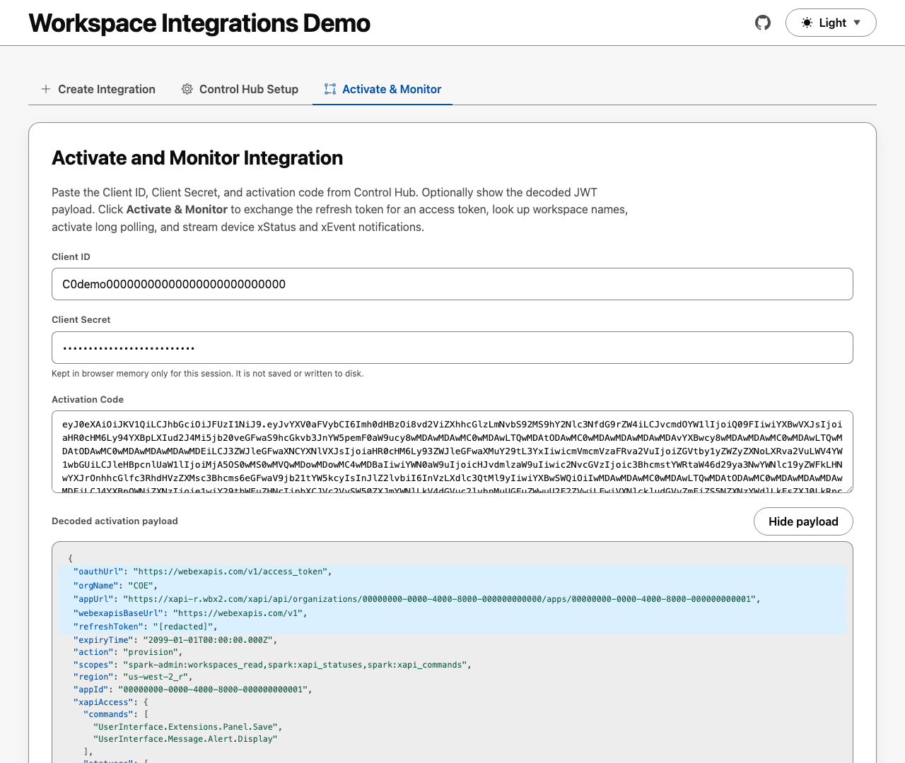
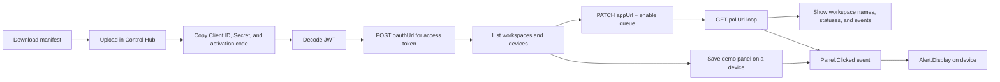

# Workspace Integrations Demo

This project lets you easily demonstrate creating a Webex Workspace Integration from the browser, activate it with a Control Hub JWT, and watch live device xStatus and xEvent notifications.

This GitHub Pages app generates a new integration manifest, exchanges the activation code for an access token, looks up workspace names in the org, enables the Webex long-poll queue, and streams formatted device updates. It is intended for Control Hub administrators and developers who want a working example of the Workspace Integrations activation and notification flow.

<a href="https://wxsd-sales.github.io/workspace-integrations-demo">
  <picture>
    <source media="(prefers-color-scheme: dark)" srcset="screenshots/readme-screenshot-monitor-dark.png">
    <source media="(prefers-color-scheme: light)" srcset="screenshots/readme-screenshot-monitor-light.png">
    
  </picture>
</a>


## Overview

The static app in `/webapp` has three tabs.

### Create Integration

This builds a unique `org_private` manifest (with a fresh UUID on every download) with the required Webex REST API scopes to query Workspaces and Devices, plus the RoomOS xAPI statuses, events, and commands used by this demo. The generated JSON is hidden by default; use **Show manifest** to inspect it, including syntax-colored keys and values.

<a href="https://wxsd-sales.github.io/workspace-integrations-demo">
  <picture>
    <source media="(prefers-color-scheme: dark)" srcset="screenshots/readme-screenshot-create-dark.png">
    <source media="(prefers-color-scheme: light)" srcset="screenshots/readme-screenshot-create-light.png">
    
  </picture>
</a>

### Control Hub Setup

This tab walks through uploading the generated manifest in Control Hub and collecting the Client ID, Client Secret, and Activation Code used on the next tab.

<a href="https://wxsd-sales.github.io/workspace-integrations-demo">
  <picture>
    <source media="(prefers-color-scheme: dark)" srcset="screenshots/readme-screenshot-setup-dark.png">
    <source media="(prefers-color-scheme: light)" srcset="screenshots/readme-screenshot-setup-light.png">
    
  </picture>
</a>

1. Download the JSON on **Create Integration**.
2. In [Control Hub](https://admin.webex.com/workspaces/integrations) go to **Workspaces > Integrations**, choose **Add / Upload integration**, and upload the file.
3. Copy the **Client ID** and **Client Secret**. This demo keeps them in browser memory for the session only.
4. Open the integration, choose **Activate**, and copy the **activation code** JWT.
5. Continue on **Activate & Monitor**.

### Activate and Monitor Integration

This tab lets you paste your Workspace Integrations Control Hub Client ID, Client Secret, and Activation Code. The Activation Code is a JSON Web Token (JWT). Use **Show payload** to inspect the decoded claims. Fields this demo uses are highlighted, including `oauthUrl`, `appUrl`, `webexapisBaseUrl`, and `refreshToken`. The refresh token is redacted in the preview and never stored by this web app.

Once ready, click **Activate & Monitor**. That hides the decoded payload and replaces the credential fields with a reminder to click **Stop monitoring** to show them again. The app then:

1. Generates an `Access Token` using the Client ID, Client Secret and Refresh Token via the OAuth Url

    <a href="https://wxsd-sales.github.io/workspace-integrations-demo">
        <picture>
            <source media="(prefers-color-scheme: dark)" srcset="screenshots/readme-screenshot-activate-dark.png">
            <source media="(prefers-color-scheme: light)" srcset="screenshots/readme-screenshot-activate-light.png">
            
        </picture>
    </a>
    
2. Activate the Webex Workspace Integration by making a PATCH request to the App Url

    ```json
        {
        "provisioningState": "completed",
            "queue": {
                "state": "enabled"
            }
        }
    ```
3. Queries all Workspaces and Devices in your Webex Org so workspace names can be shown on received events, and so you can search for a device to install the demo panel.
4. Monitors and displays Device xEvents and xStatus changes via HTTP Long Polling. The web app continuously performs a HTTP GET request against the poll queue URL returned after activating the Workspace Integration in step 2. **Messages Received** plots those queue messages per minute over a rolling one-hour window.
5. Lets you search a workspace or RoomOS product name and save a home-screen UI Extension button (`PanelId` `workspace-integrations-demo`, name **Workspace Integration Demo**) with `UserInterface.Extensions.Panel.Save`. The device list is loaded from the Webex Devices API with `type=roomdesk` and `capability=xapi`, so the button is only offered on devices that can run that xCommand. When that button is tapped, the app shows the `UserInterface.Extensions.Panel.Clicked` event and sends `UserInterface.Message.Alert.Display` back to the same device.


Client ID, Client Secret, refresh tokens, and access tokens stay in browser memory for the session only. They are not written to `localStorage` or to the downloaded manifest.


### Flow Diagram


<details>

<summary>Show Flow Diagram</summary>



</details>

## Setup

### Prerequisites & Dependencies:

- A Webex org with Control Hub admin access and Workspace Integrations enabled
- At least one shared-mode Webex device in a workspace (personal devices do not send these notifications)
- Workspace utilization and/or environmental data enabled in Control Hub if you want RoomAnalytics values
- Node.js 20+ for local development
- A modern desktop browser. GitHub Pages calls Webex APIs directly (some browsers block those cross-origin requests). Local testing uses `npm run devProxy` to proxy those calls
- After the repo is public, enable GitHub Pages with the **GitHub Actions** source so `/.github/workflows/pages.yml` can publish `/webapp`


### Installation Steps:
1. For local development and testing, start the app with the Webex API proxy:
    ```sh
    npm run devProxy
    ```
    Then open http://127.0.0.1:8080/. The proxy binds to localhost only and forwards allow-listed HTTPS Webex requests so the browser is not blocked by CORS.
    Static-only serving (no proxy) is still available as `npm run serve`. To refresh the README images after UI changes:
    ```sh
    npm run screenshots
    ```
2. On **Create Integration**, optionally show the manifest preview, then click **Download manifest**.
3. Follow **Control Hub Setup**: upload the JSON under **Workspaces > Integrations**, and copy the Client ID and Client Secret.
4. Activate the integration in Control Hub and copy the activation code JWT.
5. Open **Activate & Monitor**, paste Client ID, Client Secret, and Activation Code, then click **Activate & Monitor**. Use **Show payload** to inspect the decoded JWT. After monitoring starts, click **Stop monitoring** to show the credential fields again.


## Demo

Check out our live demo, available [here](https://wxsd-sales.github.io/workspace-integrations-demo)!

*For more demos & PoCs like this, check out our [Webex Labs site](https://collabtoolbox.cisco.com/webex-labs).


## License

All contents are licensed under the MIT license. Please see [license](LICENSE) for details.


## Disclaimer

Everything included is for demo and Proof of Concept purposes only. Use of the site is solely at your own risk. This site may contain links to third party content, which we do not warrant, endorse, or assume liability for. These demos are for Cisco Webex use cases, but are not Official Cisco Webex Branded demos.


## Questions
Please contact the WXSD team at [wxsd@external.cisco.com](mailto:wxsd@external.cisco.com?subject=workspace-integrations-demo) for questions. Or, if you're a Cisco internal employee, reach out to us on the Webex App via our bot (globalexpert@webex.bot). In the "Engagement Type" field, choose the "API/SDK Proof of Concept Integration Development" option to make sure you reach our team.
